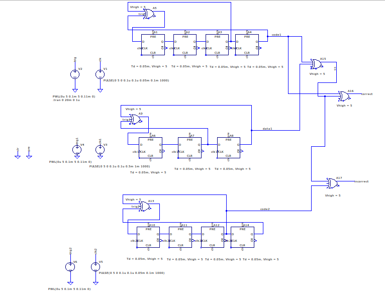
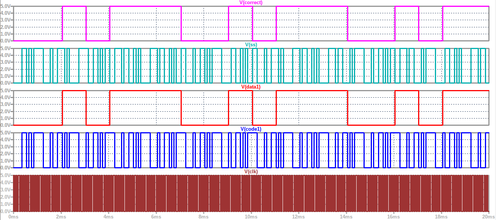
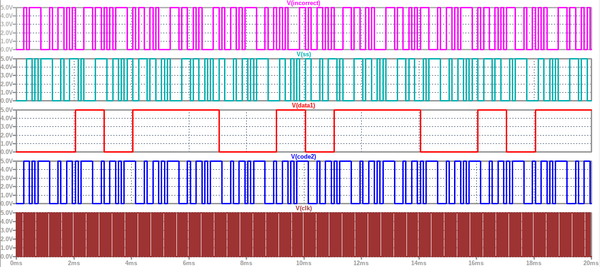

# CDMA Technique Simulation Using LTspice

## Overview

This project demonstrates a simulation of the **Code Division Multiple Access (CDMA)** technique using **LTspice**.

The circuit implements digital signal processing using flip-flops, XOR gates, and pulse/PWL voltage sources. The simulation includes signal generation, code generation, spreading, and signal detection stages.

## Software Used

* **LTspice**
* **Operating System:** Ubuntu/Linux

## Circuit Description

The LTspice schematic contains multiple digital flip-flop and XOR-gate stages.

The circuit includes:

* Clock signal generation
* Data signal generation
* Spreading/code generation
* XOR-based signal processing
* Two code/data processing sections
* Correct and incorrect detection outputs

The schematic contains signals labelled:

* `clk`
* `clk1`
* `clk2`
* `pre`
* `clr`
* `trig`
* `trig1`
* `trig2`
* `data1`
* `code1`
* `code2`
* `ss`
* `correct`
* `incorrect`

These signal labels are present directly in the LTspice schematic.

## Input Signals

The first data-related voltage source uses:

```text
PULSE(0 5 0 0.1u 0.1u 0.05m 0.1m 1000)
```

The second source uses a PWL waveform:

```text
PWL(0u 5 0.1m 5 0.11m 0)
```

A second data section uses a slower pulse:

```text
PULSE(0 5 0 0.1u 0.1u 0.5m 1m 1000)
```

These sources provide the digital waveforms used by the circuit.

## Digital Logic

The design uses several **digital D flip-flops** and **XOR gates**.

The flip-flops have:

```text
Td = 0.05m
Vhigh = 5
```

and the XOR gates use:

```text
Vhigh = 5
```

The schematic contains two groups of flip-flop/XOR circuitry, corresponding to the different signal-processing sections.

## Simulation

The transient simulation directive used in the schematic is:

```text
.tran 0 20m 0 1u
```

Therefore, the simulation runs for **20 ms** with a maximum timestep of **1 µs**.

## Schematic

Add a screenshot of the complete LTspice schematic here.



## Simulation Results

Add screenshots of the important LTspice waveform windows here.


---


The waveform plots can be used to demonstrate the behaviour of the generated clock, data, spreading/code signals, and the final detection outputs.

## Important Signals

| Signal      | Purpose                                        |
| ----------- | ---------------------------------------------- |
| `clk`       | Main clock signal                              |
| `clk1`      | Clock signal for the first processing section  |
| `clk2`      | Clock signal for the second processing section |
| `data1`     | Data signal                                    |
| `code1`     | First code signal                              |
| `code2`     | Second code signal                             |
| `ss`        | Processed/spread signal                        |
| `correct`   | Correct detection output                       |
| `incorrect` | Incorrect detection output                     |

## How to Run the Simulation

1. Install **LTspice**.
2. Clone this repository.
3. Open `CDMA.asc` in LTspice.
4. Run the transient simulation.
5. Open the waveform viewer.
6. Plot the relevant signals such as `data1`, `code1`, `code2`, `ss`, `correct`, and `incorrect`.
7. Compare the input and output waveforms.

## Objective

To simulate the basic operation of a **CDMA communication system** using LTspice and observe the behaviour of the digital signals involved in code generation, signal processing, and detection.

## Conclusion

The LTspice simulation provides a digital implementation of the CDMA technique using flip-flops and XOR logic. The generated waveforms allow the different stages of the signal-processing and detection process to be observed and verified.

## Author

**Barnik Chakraborty**

---

### Note

This repository contains the LTspice simulation files and associated documentation for educational purposes.
